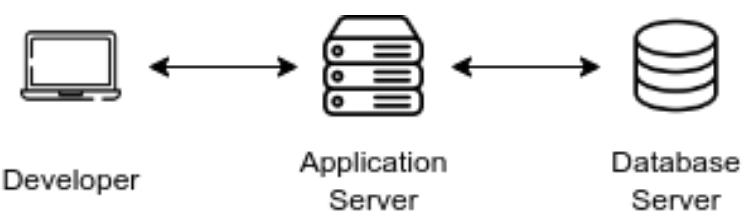

# dbserver
distributed systems assigment where these objectives were accomplished:
* learned how to use sockets to enable communication between clients and a server.
* handled multiple clients simultaneously using threads or asynchronous I/O.
* designed a simple protocol for message exchange between clients and the server.
* created a user-friendly interface for the chat application using the console.
* worked with the mutex to avoid race condition

  

